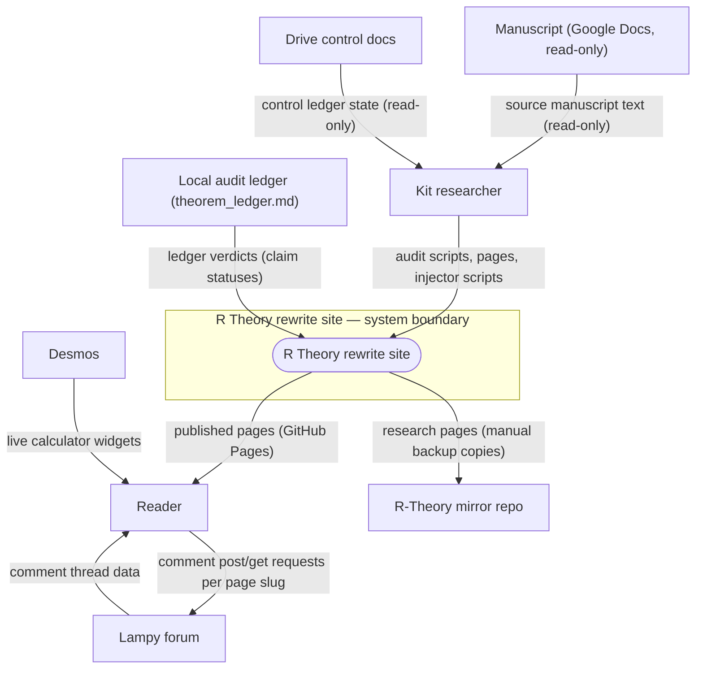
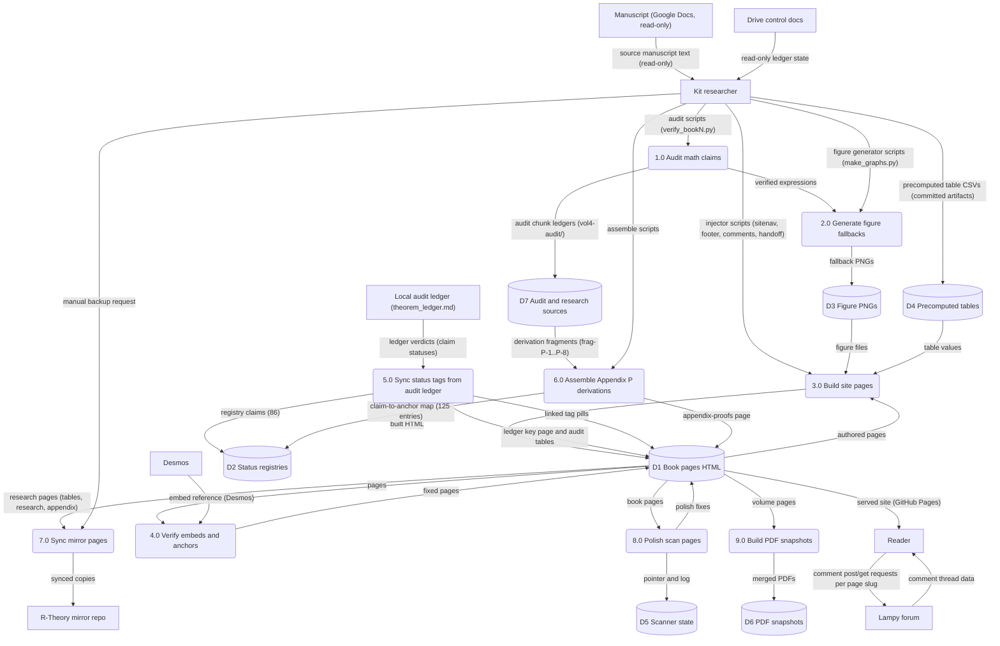
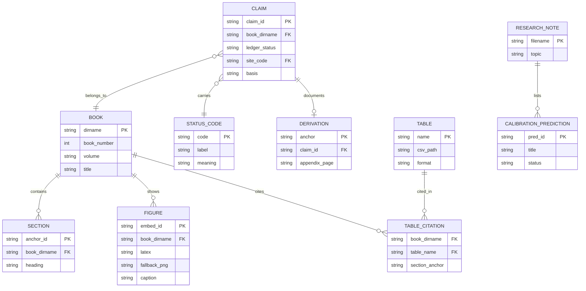

Living document — update these diagrams when adding features.
# r-theory-rewrite — Architecture

Static documentation site repo for the R Theory rewrite series. Observed: README.md describes a book-by-book, intuition-first rewrite of the R Theory manuscript (Books 0–22 across Volumes 0–IV), published as static HTML pages with live Desmos graph embeds and PNG fallbacks, pre-computed math tables, numbered audit scripts, and Python build/injector tooling. No server, no CI, no package manager observed — the repo IS the site plus its audit tooling. Live site named in README: cosbykit-afk.github.io/r-theory-rewrite (repo has_pages=true observed via API).

## 1. Context diagram (level 0)

## 2. Level-1 data flow diagram

Process grounding: 1.0 = validation/bookN/verify_bookN.py numbered checks plus vol4-audit/ chunk ledgers (audit_<chunk>.py + LEDGER_<chunk>.md per WORKFLOW.md §6); 2.0 = make_graphs.py / gen_figs_bookN.py (e.g. validation/book6/gen_figs_book6.py, validation/book8/gen_figs_book8.py) per-book fallback renderers (WORKFLOW.md §4); 3.0 = inject_sitenav.py, inject_footer.py, inject_comments.py, inject_handoff.py, build_series_index.py, build_series_toc.py; 4.0 = test_embeds.py (Desmos latex ↔ fallback PNG ↔ caption consistency) + verify_anchors.py; 5.0 = sync_status.py refresh/render/link/sync-claims/check pipeline (full source observed); 6.0 = research/_build_p/assemble.py + build_derivations_registry.py; 7.0 = manual backup observed via the mirror's commit be47ccb4 ("Backup 2026-09-25: updated webpages (tables/research/appendix) from r-theory-rewrite@c0faab2") — no sync script exists in this tree; 8.0 = scanner/README.md police scanner (rewrite-polish-scanner cron) with scanner/pointer.json + scanner/scan.log; 9.0 = pdf/build.py.

## 3. Entity–relationship diagram

No runtime data model observed — this is a static site repo. The ERD below models the document structure actually seen in the files.

Status codes observed in the sync_status.py canonical key: CP (checked proof), SC (completed symbolic check), NC (completed numerical check), ST (standard imported theorem), MA (manuscript assertion), AX (assumption or axiom), IN (incomplete or failed computation), IC (incorrect result). Claim IDs follow the b<book>-<slug>-<nnn> form (e.g. b6-modules-25-numpy-scipy-001). Figure triplet (Desmos latex, fallback PNG, caption) observed in validation/README.md embed-consistency tests. Comments are forum-backed via the injected block and live in the external Lampy forum, not in this repo.

## Grounding notes
- OBSERVED: README.md full text decoded from the API — series structure (Books 0–22, Volumes 0–IV), live site URL cosbykit-afk.github.io/r-theory-rewrite, Desmos dependency with PNG fallbacks, tables (E8 30380 weight table, R1/R2/R3a/R3b, matrix archive), validation, guide, manuscript snapshots, series index (575 entries), public domain license (Unlicense).
- OBSERVED: recursive tree listing of 393 paths — book0 through book22 directories (book20/21/22 hold one index.html each, no user-facing book numbers), contents, index, tables, research, appendix, appendix-proofs, validation (book0–book19 + vol4 + README.md), scanner, pdf, vol4-audit, guide, e8, manuscript, title, vol0, vol4, sitemap, plus build scripts (sync_status.py, inject_comments.py, inject_footer.py, inject_handoff.py, inject_sitenav.py, build_series_index.py, build_series_toc.py, verify_anchors.py).
- OBSERVED: WORKFLOW.md — read-only manuscript (Google Docs) and Drive control docs (Master Ledger V4: CP-01…CP-13, CL-001…CL-013, OI-01…OI-29, IC-1…IC-18; Notion project board as triage surface), compute stack (NumPy, SymPy, Wolfram Engine 15.0, exact integer arithmetic), precomputed tables at ~/workspace/tables/ consumed via symlinks, git+SSH push discipline with remote verification, per-book cleanup cycle, and the daily rewrite-polish-scanner cron (scanner/scan.log, scanner/pointer.json).
- OBSERVED: sync_status.py full source — syncs ~/workspace/wolfram/theorem_ledger.md (external to the repo) into status_registry.json (86 claims, Books 2–6), renders ledger/index.html (canonical status key), injects per-book AUDITSTATUS audit tables, wraps tag pills in ledger-key links, and syncs data-claim spans; strict byte-level idempotence (commit fccec4ec, 2026-09-28T22:55Z). Ledger page text states the prose audit ledger is the human record and the manuscript Google Doc stays read-only.
- OBSERVED: status_registry.json meta — 86 claims (b2=46, b3=27, b4=3, b5=2, b6=8), source ~/workspace/wolfram/theorem_ledger.md, generated 2026-09-28T22:50:47Z; id format b<book>-<slug>-<nnn>.
- OBSERVED: derivations_registry.json — 86 claims + 39 results mapped to appendix-proofs anchors (P-1…P-8); research/_build_p/ (assemble.py, build_derivations_registry.py, frag-P-1..P-8.html, claims_b2.json, claims_b3456.json, head.html, toc.html) is the Appendix P build pipeline; appendix-proofs/index.html ("Appendix P — Full Derivations") added 2026-09-28 (commit 757f8af5).
- OBSERVED: inject_comments.py docstring — the comment block calls the Lampy forum at GET/POST /app/api/comments?page=<slug>; one forum thread per page slug is the single source of truth (forum replies mirror onto the site and site comments mirror into the forum); on hosts without /app (e.g. the GitHub Pages copy) it degrades to a muted note. Comment sections added site-wide 2026-09-28 (commit 9670c52e); login-return fix 23a5e18d.
- OBSERVED: validation/README.md — per-book verify_bookN.py numbered assertion checks with scope codes (CP/SC/NC/ST/MA/AX/IN/IC) and honest worst-case error bounds; test_embeds.py checks Desmos latex ↔ fallback PNG ↔ caption consistency per book.
- OBSERVED: tables/ directory — 16 files: E8 30380 (table_30380_full.csv, table_30380_dominant.csv, table_30380_summary.json), gammas_critical.csv, M_so16_critical.csv, singlet_critical.csv, Pi_pm_critical.csv, B_critical.csv, U_Splus_critical.csv, Me_reference_diag.csv + Me_reference_params.json, P54_135_diag.csv, Pi0/Pi2/Pi_rest grade-diag CSVs, index.html.
- OBSERVED: research/ — index.html, calibration.html ("R Theory — Calibration Predictions", CAL-P1…P6; CAL-P6 CONFIRMED by proof per commit 9a0ff3dc; ledger opened and extended 2026-09-28), book23_feasibility.md (investigation only — "no book23 created, no repo files modified, nothing pushed"), _build_p/ pipeline sources.
- OBSERVED: pdf/ (build.py + volume-0 book20/21/22, overview, and complete PDFs), manuscript/ (R-Theory-Volume-I/II/III-original.txt snapshots + README), scanner/ (README, pointer.json, scan.log), sitemap/ + sitemap.xml, guide/ (index.html + BUILD_REPORT.md + VERIFY_REPORT.md), title/, vol0/, vol4/ indexes.
- OBSERVED: 18 commits on 2026-09-28 — comment sections + forum links, sitemap, book-navigation panels, calibration ledger (CAL-P1…P6), research index link, sync_status.py idempotence, Appendix P derivations, and the SAD architecture doc itself (34380ae8). Repo pushed 2026-09-28T22:56:00Z.
- OBSERVED: the sync to the R-Theory mirror is manual — R-Theory commit be47ccb4 (2026-09-25, Kit Cosby): "Backup 2026-09-25: updated webpages (tables/research/appendix) from r-theory-rewrite@c0faab2". No sync script, webhook, or cron exists in this repo's tree.
- OBSERVED: repo metadata via API — description "Public-domain, intuition-first visual rewrite of R Theory (E8): Volumes 0–IV, Books 0–22, … Published via GitHub Pages.", has_pages=true, default branch main.
- INFERRED: the GitHub Pages deployment mechanism (no .github/workflows and no CNAME in the tree; only has_pages=true and the URL in the README text were observed).
- INFERRED: the exact book↔table citation mapping (tables referenced from pages is observed; no machine-mapped per-book citation exists) — the TABLE_CITATION junction models the M:N shape honestly.
- INFERRED: how live Desmos widgets reach readers (embed code in the pages is observed; WORKFLOW.md §4 states live Desmos rendering cannot be browser-verified from the build machine).
