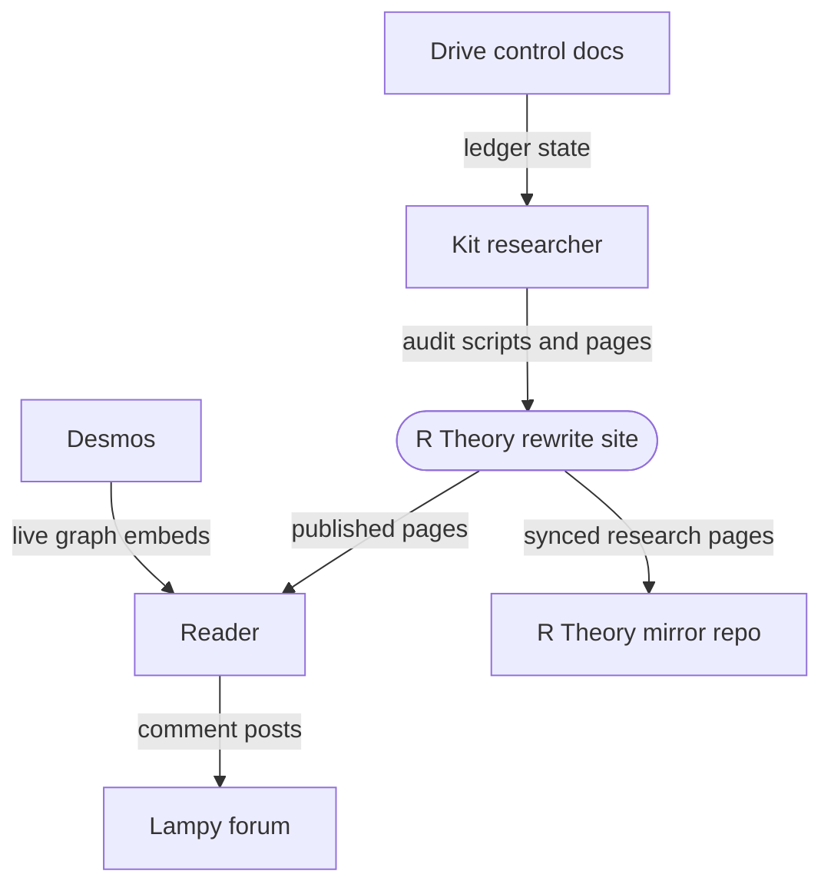
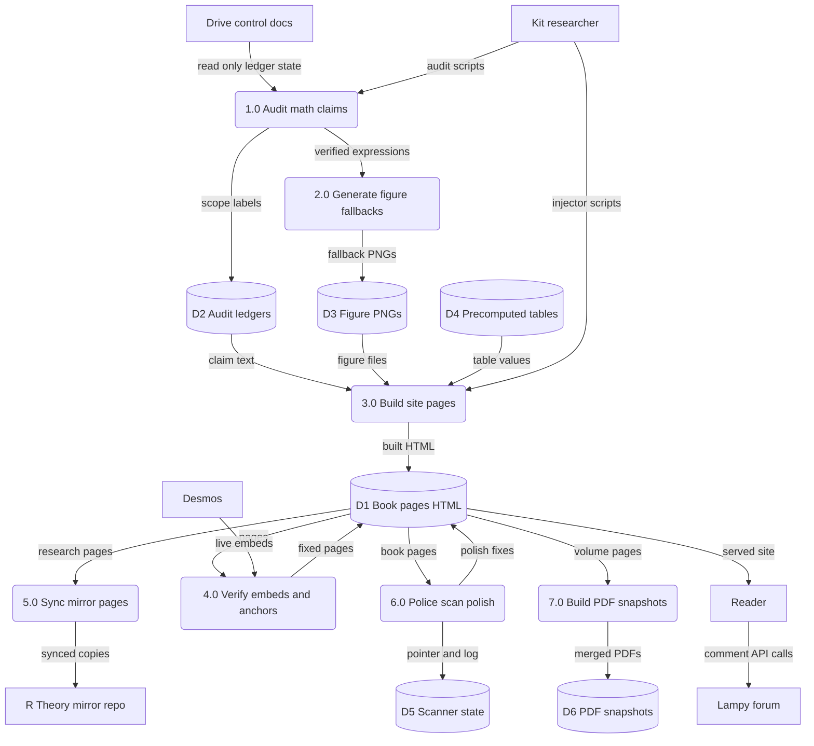
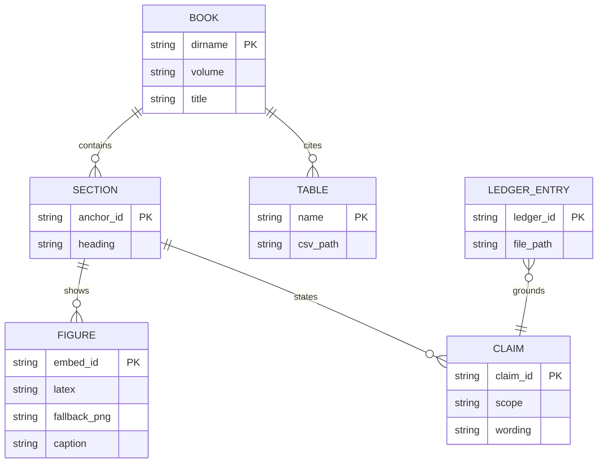

Living document — update these diagrams when adding features.
# r-theory-rewrite — Architecture

Static documentation site repo for the R Theory rewrite series. Observed: README.md describes a book-by-book, intuition-first rewrite of the R Theory manuscript (Books 0–22 across Volumes 0–IV plus a Discrete Octant volume), published as static HTML pages with live Desmos graph embeds and PNG fallbacks, pre-computed math tables, numbered audit scripts, and Python build/injector tooling. No server, no CI, no package manager observed — the repo IS the site plus its audit tooling. Live site named in README: cosbykit-afk.github.io/r-theory-rewrite.

## 1. Context diagram (level 0)

## 2. Level-1 data flow diagram

Process grounding: 1.0 = validation/bookN/verify_bookN.py, audit_N.py, LEDGER_*.md; 2.0 = make_graphs.py, gen_figs.py, gen_figures.py; 3.0 = inject_sitenav.py, inject_footer.py, inject_comments.py, inject_handoff.py, build_series_index.py, build_series_toc.py; 4.0 = test_embeds.py, verify_anchors.py; 6.0 = scanner/README.md police scanner plus pointer.json; 7.0 = pdf/build.py. 5.0 sync to R-Theory is INFERRED — the R-Theory repo description says it is synced from here but no sync script was observed in this repo's tree.

## 3. Entity–relationship diagram

No runtime data model observed — this is a static site repo. The ERD below models the document structure actually seen in the files.

Claim scope values observed in validation/README.md: CP, SC, NC, AX, MA, IC, ST, IN. Figure triplet (Desmos latex, fallback PNG, caption) observed in validation README embed-consistency tests. Comments are forum-backed via the injected block and live in the external Lampy forum, not in this repo.

## Grounding notes
- OBSERVED: README.md full text decoded from the API — series structure, live site URL, Desmos dependency, tables, validation, guide, manuscript snapshots, public domain license.
- OBSERVED: recursive tree listing of 366 paths — book0 through book22 directories, contents, index, tables, research, appendix, validation, scanner, pdf, vol4-audit, guide, e8, manuscript, title, vol0, vol4, sitemap.xml.
- OBSERVED: WORKFLOW.md — Drive-based control framework, read-only manuscript, scope labels, compute stack (NumPy, SymPy, Wolfram Engine, exact integer arithmetic).
- OBSERVED: validation/README.md — per-book audit scripts, what each verifies, assertion counts, honest error bounds.
- OBSERVED: docstrings of build_series_index.py, build_series_toc.py, inject_comments.py, inject_sitenav.py, verify_anchors.py, scanner/README.md, pdf/build.py.
- OBSERVED: no .github/workflows and no CNAME in the tree.
- INFERRED: the exact mechanism that syncs tables/research/appendix into the R-Theory mirror repo (no sync script seen in this tree; the mirror's repo description asserts it is synced from here).
- INFERRED: how the site is deployed to the live GitHub Pages URL named in the README (GitHub Pages itself was not observed, only the URL in the README text).
